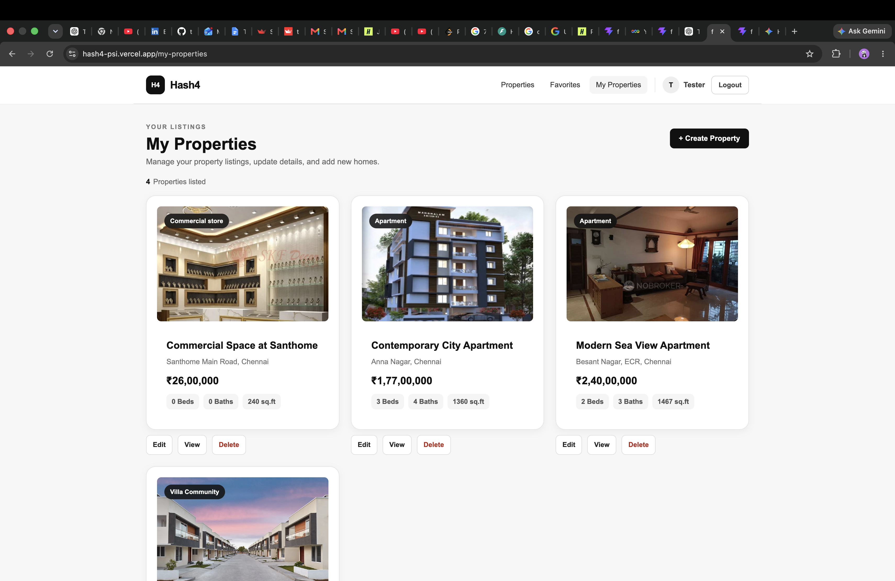
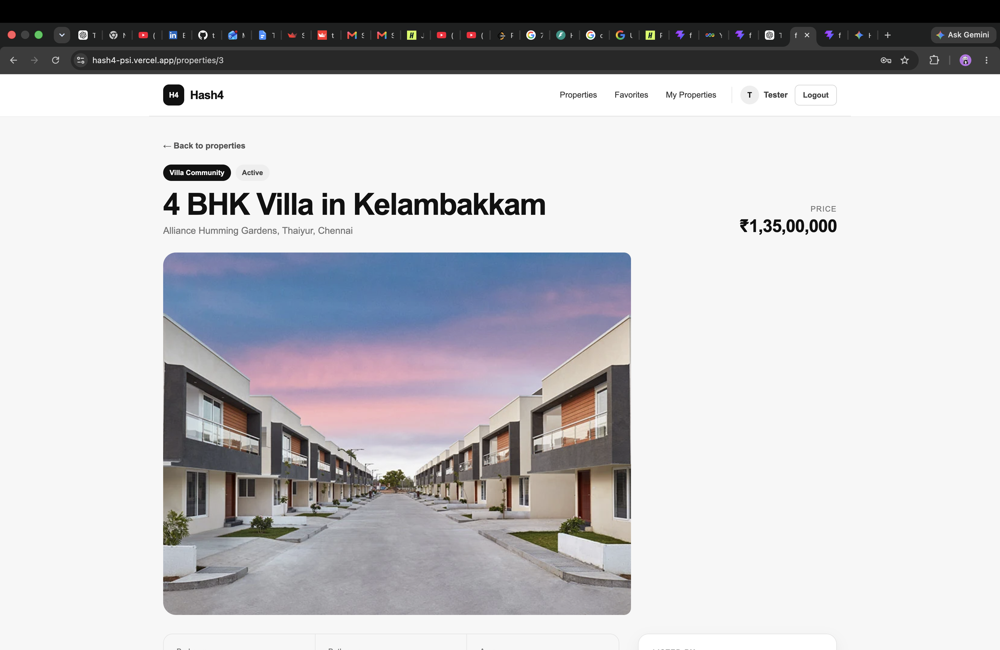
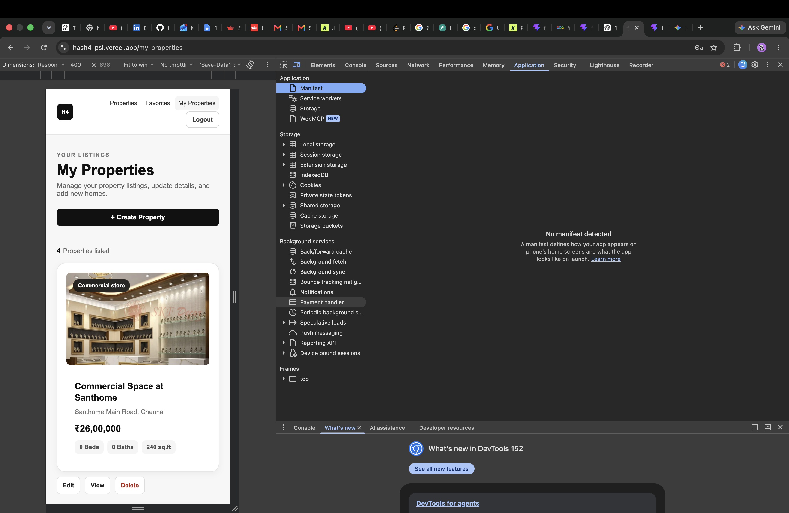

# Hash4

Hash4 is a full-stack real estate platform for browsing, managing, and saving property listings. The project was built as a production-style application using React, TypeScript, FastAPI, PostgreSQL, and AWS S3, with authentication, property ownership controls, image management, search and filtering, automated testing, and cloud deployment.

## Live Application

**Frontend:** https://hash4-psi.vercel.app/

**Backend API:** https://hash4-backend.onrender.com

## Features

### Property Discovery
- Browse available property listings
- View detailed property information
- Search properties by keyword
- Filter listings using property attributes and price ranges
- Sort property results
- Paginate property listings

### Authentication
- User registration and login
- JWT-based authentication
- Protected application routes
- Centralized handling of expired or invalid authentication tokens

### Property Management
Authenticated property owners can:
- Create property listings
- Edit their own listings
- Delete their own listings
- View and manage their properties

Ownership authorization prevents users from modifying listings they do not own.

### Property Images
- Upload property images
- Delete property images
- Support for JPEG, PNG, and WebP files
- Private AWS S3 object storage
- Presigned URLs for controlled image access

### Favorites
Authenticated users can:
- Save properties to favorites
- Remove properties from favorites
- View their saved listings

Favorites persist through the backend and PostgreSQL database.

## Tech Stack

### Frontend
- React
- TypeScript
- Vite
- React Router
- CSS

### Backend
- Python
- FastAPI
- SQLAlchemy
- Pydantic
- JWT authentication

### Database
- PostgreSQL
- Alembic database migrations

### Cloud & DevOps
- AWS S3
- Docker
- GitHub Actions
- Vercel
- Render

### Testing
- Pytest
- FastAPI TestClient

## Architecture

```text
                         ┌─────────────────────┐
                         │        User         │
                         └──────────┬──────────┘
                                    │
                                    ▼
                         ┌─────────────────────┐
                         │ React + TypeScript  │
                         │      Frontend       │
                         │       Vercel        │
                         └──────────┬──────────┘
                                    │
                              HTTPS / REST
                                    │
                                    ▼
                         ┌─────────────────────┐
                         │      FastAPI        │
                         │       Backend       │
                         │       Render        │
                         └───────┬──────┬──────┘
                                 │      │
                         SQLAlchemy      │
                                 │      │ Presigned URLs
                                 ▼      ▼
                       ┌────────────┐  ┌────────────┐
                       │ PostgreSQL │  │   AWS S3   │
                       │  Database  │  │   Images   │
                       └────────────┘  └────────────┘
```


The React frontend communicates with the FastAPI backend through REST APIs. FastAPI handles authentication, validation, business logic, authorization, property management, favorites, and image operations.

Application data is stored in PostgreSQL through SQLAlchemy, while property images are stored separately in private AWS S3 storage and accessed through presigned URLs.

## API Design

The backend exposes REST endpoints for the major application resources.

### Examples include:

```text
POST   /auth/register
POST   /auth/login

GET    /properties
POST   /properties
GET    /properties/my-properties
GET    /properties/{property_id}
PATCH  /properties/{property_id}
DELETE /properties/{property_id}

POST   /properties/{property_id}/images
DELETE /properties/{property_id}/images/{image_id}

GET    /favorites
POST   /favorites/{property_id}
DELETE /favorites/{property_id}
```

Protected endpoints require a valid JWT access token.

## Screenshots

### Property Discovery



### Property Details



### Property Management


### Responsive Design



## Authentication & Authorization

Hash4 separates authentication from authorization.

**Authentication verifies the user's identity using JWT access tokens.**

**Authorization** determines whether the authenticated user is permitted to perform an operation. Property update, deletion, and image-management operations verify ownership on the backend so that users cannot modify another user's listing simply by calling the API directly.

## Search, Filtering & Pagination

Property discovery is handled through backend query parameters rather than filtering only in the browser.

The API supports combinations of search, filtering, sorting, price constraints, and pagination. Query validation also prevents invalid ranges from being processed.

This keeps filtering behavior consistent and allows the backend to remain responsible for retrieving the appropriate dataset.

## Image Storage

Property images are stored separately from application records.

The database stores image metadata and object references, while the actual files are stored in private AWS S3 storage.

Presigned URLs provide temporary controlled access to images without making the entire storage bucket public.

## Testing

The backend currently includes 21 automated tests covering important application behavior, including:

- User registration and authentication
- Property creation
- Property retrieval
- Ownership authorization
- Property updates and deletion
- Favorites
- Search and filtering
- Pagination
- Price-range validation
- Health endpoint behavior

The test suite uses an isolated PostgreSQL test database so tests do not modify normal application data.

Run the backend tests with:

```bash
pytest -v
```

## Local Development

### 1. Clone the repository

```bash
git clone https://github.com/tanujsurana/hash4.git
cd hash4
```

### 2. Backend

```bash
cd backend
python -m venv .venv
source .venv/bin/activate
pip install -r requirements.txt
```

Configure the required environment variables for PostgreSQL, authentication, and AWS S3.

Run database migrations:

```bash
alembic upgrade head
```

Start the API:

```bash
uvicorn app.main:app --reload
```

### 3. Frontend

Open another terminal:

```bash
cd frontend
npm install
npm run dev
```

Configure the frontend API URL:

```env
VITE_API_URL=http://localhost:8000
```

The Vite development server will provide the local frontend URL.

## Docker

The backend and PostgreSQL database can also be run with Docker Compose:

```bash
cd backend
docker compose up --build
```

Docker provides a reproducible backend environment and simplifies running the API together with PostgreSQL.

## Continuous Integration

GitHub Actions is used to automate project checks as part of the development workflow.

Before deployment, the frontend is also validated with:

```bash
npm run lint
npm run build
```

## Deployment

Hash4 uses separate frontend and backend deployments:

- **Frontend:** Vercel
- **Backend:** Render
- **Database:** PostgreSQL
- **Property image storage:** AWS S3

The frontend includes SPA rewrite configuration so React Router routes such as `/login`, `/favorites`, `/my-properties`, and property-detail routes work correctly when opened directly or refreshed.

## Engineering Decisions

### Shared API Client

Frontend API requests use a shared request utility that attaches authentication tokens and handles unauthorized responses consistently.

Invalid or expired tokens are cleared and the user is redirected to authenticate again.

### Backend Ownership Enforcement

Property ownership is enforced by the API rather than relying only on frontend controls.

This prevents unauthorized modification through direct API requests.

### Separate Object Storage

Images are stored in AWS S3 instead of directly in PostgreSQL.

PostgreSQL remains responsible for structured application data, while object storage handles property image files.

### Reusable Property Components

Property cards are shared across property discovery and management views to reduce duplicated frontend logic and keep the interface consistent.

### Isolated Test Database

Automated tests use a dedicated PostgreSQL test database rather than the normal application database.

This prevents test setup and cleanup operations from affecting application data.

## Project Status

Hash4 currently supports the complete core workflow for a real estate listing platform:

**Discover properties → Authenticate → Manage listings → Upload images → Save favorites → Search and filter properties**

The application is deployed and accessible through the live frontend.

## Author

**Tanuj Kumar**

MEng Computer Science
University of Cincinnati